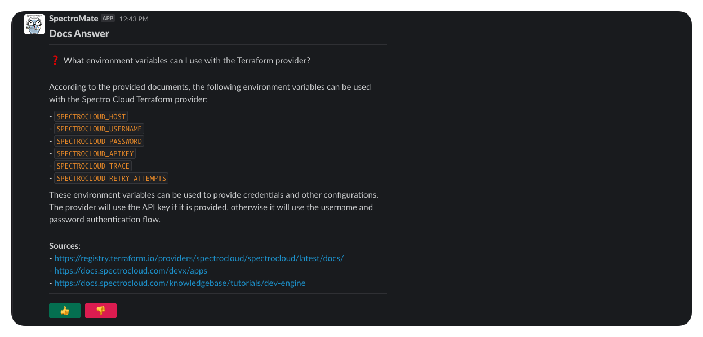

# SpectroMate

  

## Overview 🧑🏿‍🚀 👩‍🚀 🧑‍🚀

SpectroMate is an API server with extended functionality designed for Slack integration in the form of a bot. You can use SpectroMate to handle [slash commands](https://api.slack.com/interactivity/slash-commands), and [message actions](https://api.slack.com/reference/interaction-payloads). You can also use SpectroMate to handle non-slack-related events by creating API endpoints for other purposes. 

SpectroMate comes with out-of-the-box support for [Mendable](https://www.mendable.ai/). You can use your Mendable-trained model to answer documentation-related questions by using the `/docs ask <question>` slash command.

  

  

SpectroMate is optimized for deployment in [Palette](https://console.spectrocloud.com) using Palette's Dev Engine (PDE) platform. 

Palette's PDE simplifies the deployment and management of SpectroMate. You can deploy SpectroMate to Palette and use the [free-tier resources](https://docs.spectrocloud.com/getting-started/palette-freemium). With Palette PDE, you can deploy SpectroMate at no cost and in under five minutes! Check out the [Getting Started](./docs/getting-started.md) guide to learn more.

---

## Getting Started 🚀

To get started with Spectromate check out the [Getting Started](./docs/getting-started.md) guide.

---

## API Endpoints 🕹️

The following endpoints are available.

| Description                                               | Endpoint           | Method |
| ----------------------------------------------------------|-------------------| --|
| Used for health checks by external resources.             | `/health`          | `GET` |
| A slack endpoint that can be used to handle slash commands.| `/slack`           | `POST` |
| A slack endpoint for handling slack message actions.      | `/slack/actions`   | `POST` |

## Slack Commands 🛠️

The following Slack commands are available.

| Description                                               | Command           |
| ----------------------------------------------------------|-------------------|
| Displays information to the user for how to use SpectroMate. Invalid commands return the help response.             | `/help`          |
| Used to query the Mendable and ask documentation questions to a trained model.| `/ask`           |
| Same as the `/ask` but responses are only visible to the user versus the entire channel.      | `/pask`   |

## Slack Actions 🪡

Spectromate supports the following actions.

| Description                                               | Action           |
| ----------------------------------------------------------|-------------------|
| Handles the possitive feedback button and submits the feedback to Mendable.  | `ask_model_positive_feedback` |
| Handles the negavtive feedback button and submits the feedback to Mendable.| `ask_model_negative_feedback` |

## Architecture 📐

The following is an architectural overview of SpectroMate. 

To learn more about SpectroMate, review the [internal](./docs/internal.md) technical document.

## Supported Features and Limitations  🔍

|Action| Supported | Notes |
|---|---|---|
| Slash command| ✅ | Supported through the `/slack` endpoint.|
| Message buttons | ✅| Supported through the `/slack/actions` endpoint.|
| Mentions | ❌ | Currently unavailable. |
| Threads | ❌ | Currently unavailable. |
| Health checks | ✅ | Supported through the `/health` endpoint.|
| Verify Slack signature| ✅ | Verification of Slack signature is applied to all Slack endpoints.|
| Metrics | ❌ | Currently unavailable. |
| Proxy   |✅ | SpectroMate will honor the `HTTP_PROXY`, `HTTPS_PROXY` and `NO_PROXY` environment variables.|

:warning: There is a limitation with `pask` messages when submitting feedback. The answer response message is replaced with a feedback acknowledgment message. This behavior stems from the Slack API not including the original message when handling action events from an ephemeral message.

# Contribution 🫶

We welcome all types of contributions. Please take a moment and review our [contribution guidelines](./docs/contributions.md).

# Legal & Acknowledgment 📜

Review the [Open Source Acknowledgment](./docs/open-source.md) reference resource for a complete list of open-source licenses used in this project.
