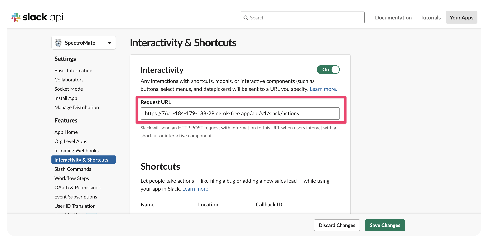
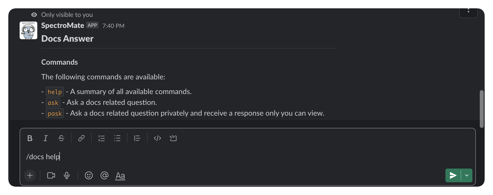

# Generic Kubernetes Deployment

This guide describes the process to deploy the Spectromate Slackbot on a Kubernetes cluster. The deployment includes creating a dedicated namespace, setting up secrets, deploying Redis, and deploying the Spectromate app.


## Prerequisites


- A Slack application available for integration with Spectromate. Check out the [Slack App Quick Start](https://api.slack.com/authentication/quickstart) guide to learn more.
- Kubernetes cluster.
- kubectl installed and configured to access the cluster.
- Base64 encoded values for the following secrets:
  - A custom Redis password.
  - [Slack signing secret](https://api.slack.com/authentication/verifying-requests-from-slack#about).
  - [Mendable API](https://www.mendable.ai/) key.


### Resource Requirements

The Slackbot and Redis components have the following resource requirements:

- **Memory**: Each Slackbot replica and Redis instance has a limit of 500Mi and a request of 500Mi.
- **CPU**: Each Slackbot replica and Redis instance has a limit of 500m and a request of 500m.

**Total memory consumption**: Slackbot memory + Redis memory = 1000Mi + 500Mi = 1500Mi

**Total CPU consumption**: Slackbot CPU + Redis CPU = 1000m + 500m = 1500m

To accommodate the Spectromate Slackbot deployment, the Kubernetes cluster should have at least *1500Mi* of available memory and *1500m* (1.5 CPU cores) of available CPU resources. Please note that these requirements are for the deployment itself and do not account for any overhead or additional resources needed by the Kubernetes control plane and other workloads running on the cluster.

---

## Deployment Steps

1. Replace the placeholders in the Kubernetes configuration file:

   - Replace `<REPLACE ME>` in the `redis-secret` section with your custom base64 encoded Redis password.
   - Replace `<REPLACE ME>` in the `slack-signing-secret` section with your base64 encoded Slack signing secret.
   - Replace `<REPLACE ME>` in the `mendable-api-key` section with your base64 encoded Mendable API key.

2. Apply the configuration to your Kubernetes cluster:

    ```shell
    kubectl apply --filename spectromate-deployment.yaml
    ```


3. Verify that the resources have been created and are running:

    ```shell
    kubectl get --namespace spectromate --all-namespaces
    ```


4. Extract the load balancer URL so you can specify this to your Slack application.

    ```shell
    kubectl get service --namespace spectromate slackbot --output jsonpath='{.status.loadBalancer.ingress[0].ip}'
    ```

    Output Example:
    ```shell
    a1234567890abcd1234e56789f01234g-5678901234.us-west-2.elb.amazonaws.com
    ```

5. Use the output URL and use this with your Slack App. Navigate to [https://api.slack.com/apps](https://api.slack.com/apps) to access your Slack apps.


6. You will access both elements highlighted in the image. Start with the first element, by clicking on the left **Main Menu** and selecting **Slash Command**.

    

7. Create a new slash command titled `docs` and provide your Ngrok URL to the command. Append `/api/v1/slack` to the end of URL.

    

8. Save your changes and navigate back to the main details page.


9. From the left **Main Menu**, select **Interactivity & Shortcuts**.

11. Toggle the **Interactvity** button to **On**. 

12. Use your load balancer URL and paste the URL into the text input box. Append `/api/v1/slack/actions` to the end of the URL and save your changes.

    

13. Navigate to a Slack channel and issue the Slack command `/docs help` in any channel.


    You should receive an output similar to the following.




## Components

| Component            | Description                                                                                                 |
|----------------------|-------------------------------------------------------------------------------------------------------------|
| Namespace            | A dedicated namespace called `spectromate` is created for the deployment.                                   |
| Secrets              | Three secrets are created to store sensitive information: Redis password, Slack signing secret, API key.    |
| Redis                | A single instance of Redis is deployed in the `spectromate` namespace for caching and managing data.        |
| Slackbot             | The Spectromate Slackbot is deployed with two replicas in the `spectromate` namespace.                      |


## Services

Two services are created to expose the Redis and Slackbot deployments:

- `redis`: A ClusterIP service that exposes the Redis deployment within the cluster.
- `slackbot`: A LoadBalancer service that exposes the Slackbot deployment externally.

Once the deployment is successful, the Slackbot will be accessible through the LoadBalancer's external IP on port 3000.
