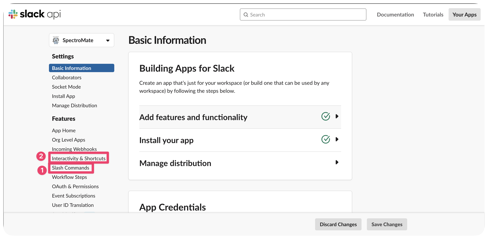
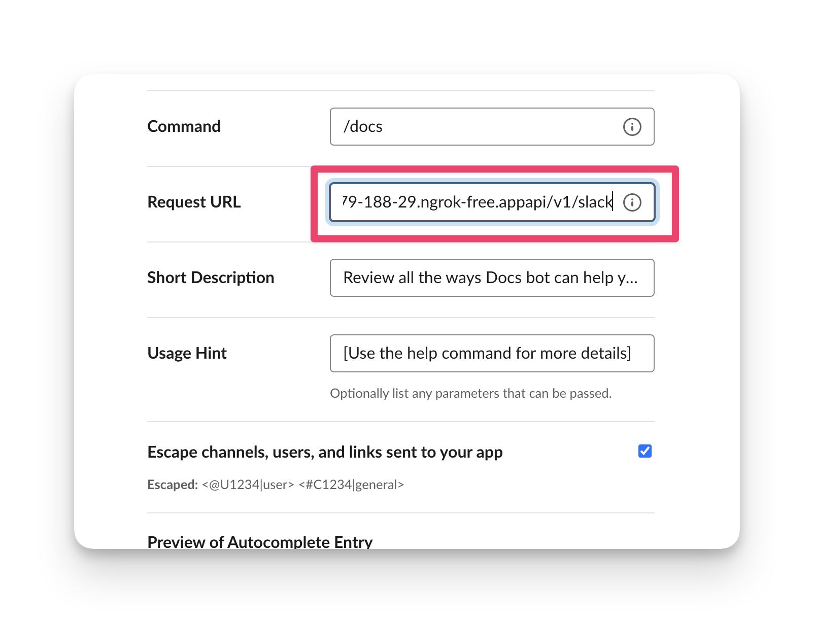
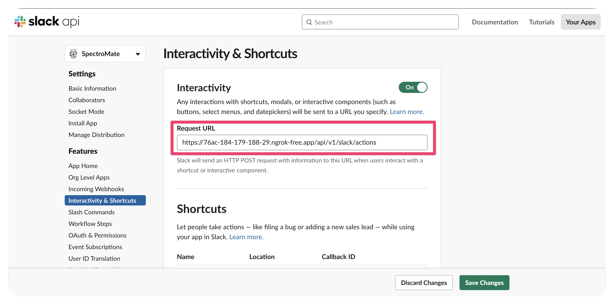

# Development Environment

To get started, use the following steps.

## Software Requirements


If you want to work on Spectromate, you will need to install the following software and actions completed.

:warning: This project uses Go Modules making it safe to work with it outside of your existing GOPATH


* [Docker](https://docs.docker.com/get-docker/) v20.10.0 or greater.

* [Go](https://golang.org/doc/install) 1.20 or greater.

* [Ngrok](https://ngrok.com/download) v3.2.2 or greater.

* [A Slack App](https://api.slack.com/apps) available that has access to your target workspace.

## Setup
The following instructions assume a directory in your home directory outside of the standard GOPATH.

1. Clone the repository by using the following command.

    ```shell
    $ mkdir -p $HOME/projects/spectromate/; cd $HOME/projects/spectromate/
    $ git clone git@github.com:spectrocloud/spectromate.git
    ```

2. Issue the command `make init`. This command will download all the required project dependencies.

    ```shell
    make init
    ```

3. The following command is used to set up the local development support dependencies, such as Redis and Ngork.

    ```shell
    make start
    ```

4. Copy the URL Ngrok exposed in the output. 

    ```shell
    $ make start
    Starting the application and ngrok...
    [+] Running 3/3
    ✔ Network docs-slack-bot_default        Created                                                                                                                                                       0.0s
    ✔ Container docs-slack-bot-redis-1      Started                                                                                                                                                       0.3s
    ✔ Container docs-slack-bot-redis-cli-1  Started                                                                                                                                                       0.5s
    Ngrok URL: https://76ac-184-179-188-29.ngrok-free.app
    ```

5. Create a `env` file at the root of the project.

    ```shell
    touch .env
    ```

6. Populate the **.env** file with your respective credentials.

    ```shell
    export SLACK_SIGNING_SECRET=....
    export MENDABLE_API_KEY=....
    ```

7. Start the local server.

    ```shell
    make server
    ```

8. Source the `.env` file.

    ```shell
    source .env
    ```

9. Navigate to your [Slack app ](https://api.slack.com/apps) and open up your app's details page. 


10. You will access both elements highlighted in the image. Start with the first element, by clicking on the left **Main Menu** and selecting **Slash Command**.

    

11. Create a new slash command titled `docs` and provide your Ngrok URL to the command. Append `/api/v1/slack` to the end of URL.

    

12. Save your changes and navigate back to the main details page.


13. From the left **Main Menu**, select **Interactivity & Shortcuts**.

14. Toggle the **Interactvity** button to **On**. 

15. Use your Ngrok URL and paste the URL into the text input box. Append `/api/v1/slack/actions` to the end of the URL and save your changes.

    

16. Navigate to a Slack channel and issue the Slack command `/docs help`.


You should receive an output similar to the following.


You now have a functional test application connected to your local workstation. 

17. Stop the local server by pressing the `Ctrl` + `C`.


Make your changes and start the server with the `make server` command to test the new behavior. 

```shell
make server
Starting the server...
go run main.go
2023/04/20 19:44:15 maxprocs: Leaving GOMAXPROCS=8: CPU quota undefined
{"level":"info","time":1682045055,"message":"Server is configured for port 3000 and listing on 0.0.0.0:3000"}
{"level":"info","time":1682045055,"message":"Redis is configured for localhost:6379"}
{"level":"info","time":1682045055,"message":"Trace level set to: INFO"}
{"level":"info","time":1682045055,"message":"Starting server..."}

```


## Testing

Add test cases to new functions and new commands. Invoke the Go tests from the root namespace. The pipeline will invoke the Go tests as well.
```shell
go test -race  ./...
```