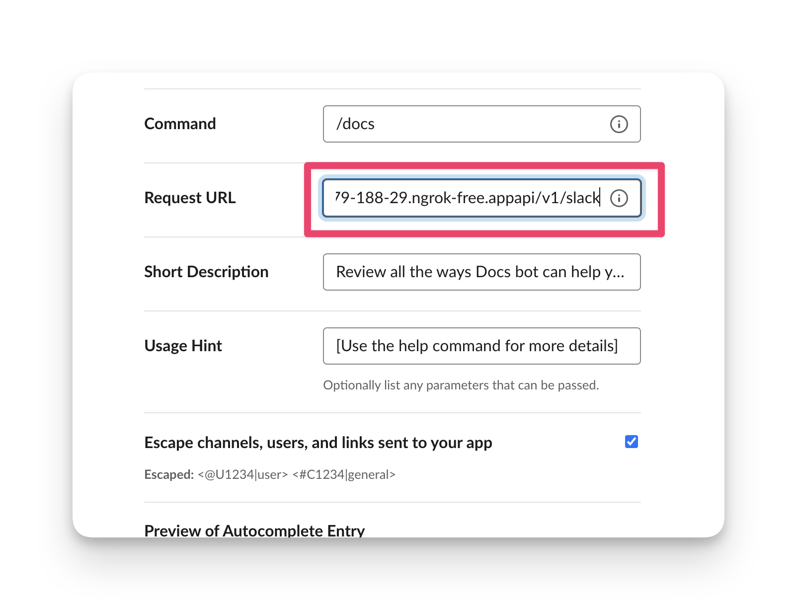

# Getting Started

You can deploy SpectroMate into a highly-available Kubernetes environment through Palette's Dev Engine (PDE). Palette has a free-tier offering for a fully managed Kubernetes environment that you can consume without having any prior Kubernetes knowledge and experience. PDE provides many benefits for you out-of-the-box


- Get access to up to 12 CPUs, 20 GB of Memory, and 20 GB of storage at no cost through the free tier.
- Simplified Kubernetes configurations, allowing developers to focus on what matters
- Complementary managed Kubernetes clusters for easy deployment and management of applications
- Out-of-the-box support for several 3rd party services such as [Postgres](https://docs.spectrocloud.com/devx/app-profile/services/service-listings/postgresql-db), [Vault](https://docs.spectrocloud.com/devx/app-profile/services/service-listings/vault), Kafka and more.


In this guide, you will learn how you can deploy SpectroMate to Palette's Dev Engine environment and get started with SpectroMate in less than five minutes.


> If you want to deploy SpectroMate to an existing Kubernetes cluster, check out the [Generic Kubernetes](../deployment/k8s-generic/README.md) guide.


# Prerequisites 

* A [Mendable API](https://www.mendable.ai/) key.

* A Spectro Cloud account. You can signup for a free account [here](https://console.spectrocloud.com/) at no cost, and no credit card is required.

* [Git](https://git-scm.com/downloads) v2.30.0+ or greater.

# Deployment


1. Log in to [Spectro Cloud](https://console.spectrocloud.com).


2. Click on the user **User Menu** and select **My API Keys**.
    


3. Next, click on **Add New API Key.** Fill out the required input field, **API Key Name**, and the **Expiration Date**. Click on **Confirm** to create the API key. Copy the key value to your clipboard, as you will use it shortly.


4. Open up a local terminal window.


5.  Clone the repository.
    ```shell
    git clone git@github.com:spectrocloud/spectromate.git
    ```

6. Navigate to the **deployment/terraform/** folder.

    ```shell
    cd deployment/terraform/
    ```
7. Export your credentials as environment variables. Replace `...` with your respective value.
    ```shell
    # Slack Secret
    export TF_VAR_slack_signing_secret=...
    ```
    ```shell
    # Mendable API key
    export TF_VAR_mendable_api_key=...
    ```

    ```shell
    # Spectro Cloud API key
    export SPECTROCLOUD_APIKEY=...
    ```
7. Initialize Terraform.

    ```shell
    terraform init
    ```

8. Preview the terraform plan.

    ```shell
    terraform plan
    ```
    
9. Deploy the infrastructure.

    ```shell
    terraform apply -auto-approve
    ```

10. Get the load balancer URL by issuing the command provided in the terraform output.

    ```shell
    terraform output -raw kubeconfig > c1.config && export KUBECONFIG=$(pwd)/c1.config && \
        kubectl get svc -n spectromate-app-spectromate-ns spectromate-app-spectromate-svc -o jsonpath='{.status.loadBalancer.ingress[0].hostname}'
    ```

11. [Optional] Create a CNAME record for the load balancer URL and assign it as the record value. In the following steps, use your custom domain as the base URL.


12. Use the output URL in your Slack App. Navigate to [https://api.slack.com/apps](https://api.slack.com/apps) to access your Slack apps.


13. You will access both elements highlighted in the image. Start with the first element, by clicking on the left **Main Menu** and selecting **Slash Command**.

    

14. Create a new slash command titled `docs` and provide your custom domain name or the exposed load balancer URL in the **Request URL** input field. Append `/api/v1/slack` to the end of URL.

    

15. Save your changes and navigate back to the main details page.


16. From the left **Main Menu**, select **Interactivity & Shortcuts**.

17. Toggle the **Interactivity** button to **On**. 

18. Use your load balancer URL OR custom domain name and paste the URL into the text input box. Append `/api/v1/slack/actions` to the end of the URL and save your changes.

    


19. The last step is for you to review your resources in Palette. Navigate back to your browser and open up [Palette](https://console.spectrocloud.com). 

20. Navigate to the left **Main Menu** and click on **Clusters**.

21. Click on **cluster-1** to access the cluster details view. From the cluster details page, you can review the status of your virtual cluster, monitor workloads, download the kubeconfig file, and more.

    


You have now deployed SpectroMate successfully into your Slack workspace. 

# Validation

1. Open up Slack and navigate to a Slack channel.


2. Issue the following Slack command.

    ```shell
    /docs help
    ```


    You should receive an output similar to the following.


# Next Steps

You can now use SpectroMate in your Slack workspace.
Palette's Dev Engine reduces the overhead and challenge in deploying containerized applications into a Kubernetes environment. 

 SpectroMate comes with Mendable support out-of-the-box. Use SpectroMate to help your organization access information more easily by taking advantage of natural language models trained on your information.


If you wish to add new Slack commands and features, you can fork the repository and start adding your own endpoints and commands. We also welcome [contributions](../docs/contributions.md) 🫶

